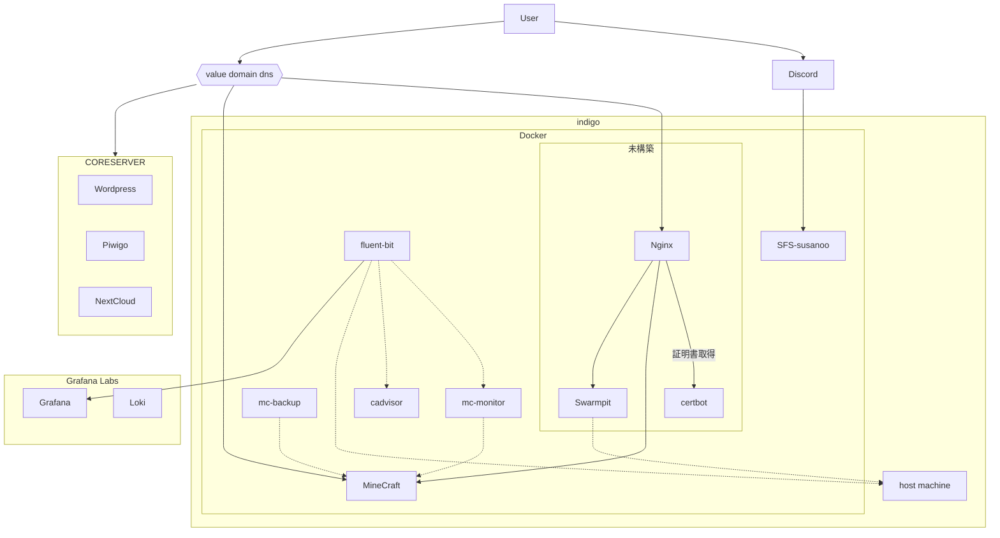

# it-infrastructure-server

## 構成図

```mermaid
flowchart TB

OU1[User]
OU2[Discord]
DNS{{value domain dns}}
subgraph S1[indigo]
  MC["host machine"]
  subgraph DC[Docker]
    subgraph NOT["未構築"]
      C1[Nginx]
      C2[certbot]
      C9[Swarmpit]
    end
    C3[MineCraft]
    C8[mc-backup]
    C4[fluent-bit]
    C5[mc-monitor]
    C6[cadvisor]
    C7[SFS-susanoo]
  end
end
subgraph S2[CORESERVER]
  SS1[Wordpress]
  SS2[Piwigo]
  SS3[NextCloud]
end
subgraph OS1["Grafana Labs"]
  OSS1[Grafana]
  OSS2[Loki]
end

OU1-->OU2
OU2-->C7
OU1-->DNS
DNS-->S2
DNS-->C1
DNS-->C3
C1--証明書取得-->C2
C1-->C3
C1-->C9
C8-.->C3
C5-.->C3
C4-.->C5
C4-.->C6
C4-.->MC
C4-->OSS1
C9-.->MC
```
