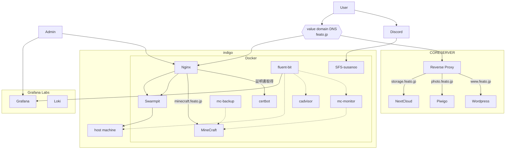

# it-infrastructure-server

## 構成図

```mermaid
flowchart TB

OU0[Admin]
OU1[User]
OU2[Discord]
DNS{{value domain DNS \n feato.jp}}
subgraph S1[indigo]
  MC["host machine"]
  subgraph DC[Docker]
    C1[Nginx]
    C2[certbot]
    C9[Swarmpit]
    C3[MineCraft]
    C8[mc-backup]
    C4[fluent-bit]
    C5[mc-monitor]
    C6[cadvisor]
    C7[SFS-susanoo]
  end
end
subgraph S2[CORESERVER]
  SS0[Reverse Proxy]
  SS1[Wordpress]
  SS2[Piwigo]
  SS3[NextCloud]
end
subgraph OS1["Grafana Labs"]
  OSS1[Grafana]
  OSS2[Loki]
end

OU1-->OU2
OU2-->C7
OU1-->DNS
DNS-->SS0
DNS-->C1
C1--証明書取得-->C2
C1--minecraft.feato.jp-->C3
C1-->C9
C8-.->C3
C5-.->C3
C4-.->C5
C4-.->C6
C4-.->MC
C4-->OSS1
C9-->MC
SS0--www.feato.jp-->SS1
SS0--photo.feato.jp-->SS2
SS0--storage.feato.jp-->SS3
OU0-->C1-->C9
OU0-->OSS1
```

現在のSwarm運用は [deploys/README.md](deploys/README.md)、
Minecraft確定構成と移行手順は [minecraft/README.md](minecraft/README.md) を参照してください。
上の図は旧構成です。
