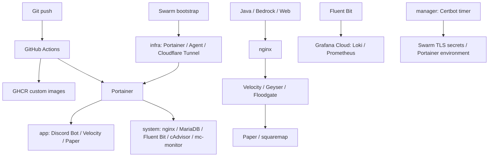

# it-infrastructure-server

Docker Swarm 上の本番インフラと Minecraft サーバーを管理します。

日常更新は Git push → GitHub Actions → GHCR → Portainer → app/system です。
初期構築と infra の更新は bootstrap から行います。

- [本番構築・Portainer 設定・移行・rollback](deploys/README.md)
- [Minecraft 構成と実機確認](minecraft/README.md)
- [採用バージョン](deploys/versions.md)
- [ユーザー向け変更記録](changes/README.md)
